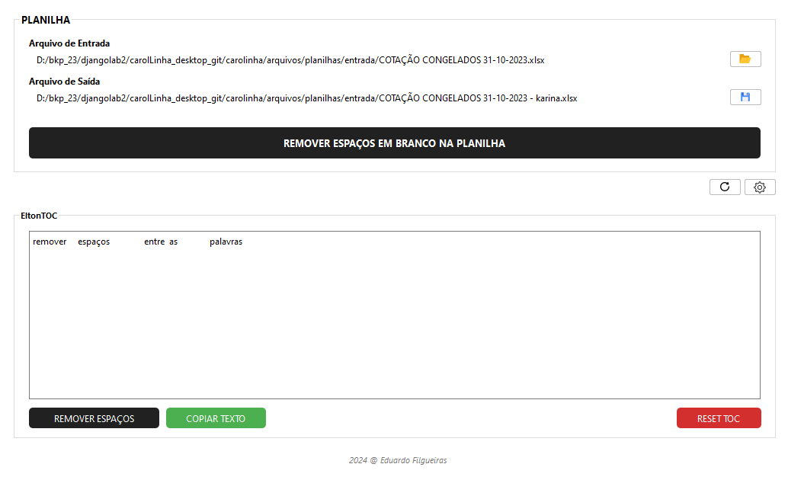

<h1 align="left">CarolLinha</h1>

<h2>Tecnologias</h2>
Esse projeto foi desenvolvido com as seguintes tecnologias:  
<ul>
    <li>Python</li>
    <li>PyQt6</li>
</ul>
<h2>Projeto</h2>

Projeto desenvolvido com a finalidade de remover espaços em branco desnecessários entre as palavras de um texto numa planilha. 

Normalmente esses espaços surgem no texto, quando se converte um arquivo tipo word ou pdf para o formato de planilhas excel (.xls).

O programa "varre" as células da planilha retirando esses espaços em branco. Na opção de configuração, é possível ajustar o range de colunas e linhas para essa varredura.

Conta também com a opção remover esses espaços em branco diretamente de um bloco de texto (EltonTOC). Basta copiar e colar o texto no caixa de entrada do programa e apertar o botão para retirar os espaços... 

Projeto pessoal que foi aproveitado em ambiente de trabalho.

